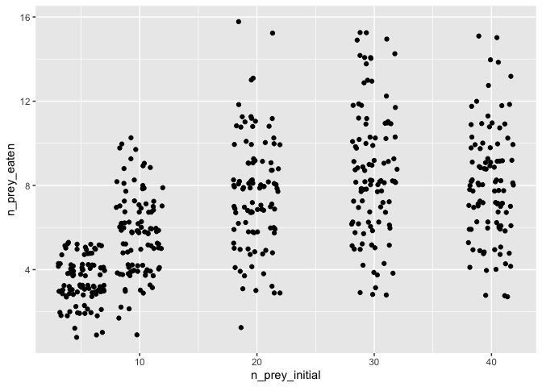
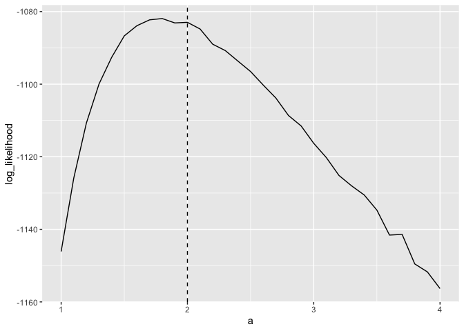

<!-- README.md is generated from README.Rmd. Please edit that file -->

# frbayes

<!-- badges: start -->

[](https://codecov.io/github/ben18785/frbayes)

<!-- badges: end -->

The goal of frbayes is to estimate functional response models using
stochastic models of population dynamics.

## Installation

You can install the development version of frbayes from
[GitHub](https://github.com/) with:

``` r
# install.packages("devtools")
devtools::install_github("ben18785/frbayes")
```

## Example

We first show how we can examine the fit of a functional response model
to synthetically generated data, where the parameters of the process are
known. We assume that data generating process is a stochastic
Rogers-II-type model, where the process is assumed to follow a chemical
reaction equation of the form:

$$
\text{prey} \xrightarrow{\text{rate}} \text{prey} - 1,
$$

where the rate of this reaction is given by:

$$
\text{rate} = \frac{a \cdot \text{prey}}{1 + a \cdot h \cdot \text{prey}},
$$

where $a$ is a capture rate and $h$ is a handling time. Here, we assume
in our synthetic data that $a=2$ and $h=0.1$.

We suppose that 100 replicates were performed at initial prey counts of:
5, 10, 20, 30, 40, and we generate a possible observed dataset for this
experimental setup.

``` r
library(frbayes)
#> 
#> Attaching package: 'frbayes'
#> The following object is masked from 'package:stats':
#> 
#>     simulate
library(ggplot2)
library(purrr)
library(dplyr)
#> 
#> Attaching package: 'dplyr'
#> The following objects are masked from 'package:stats':
#> 
#>     filter, lag
#> The following objects are masked from 'package:base':
#> 
#>     intersect, setdiff, setequal, union
library(tidyr)


# experiment details
experimental_setup <- data.frame(
  n_prey_initial = c(5, 10, 20, 30, 40),
  n_replicates = 100
)

# generate synthetic data
true_parameters <- list(a = 2, h = 0.1)
df <- simulate_study(
  data = experimental_setup,
  time_max = 1,
  model = model_rogersII(),
  parameters = true_parameters
)

# plot data
df %>%
  ggplot(aes(x = n_prey_initial, y = n_prey_eaten)) +
  geom_jitter(height = 0.3)
```



We now assess the likelihood using the `log_probability` function. We
show how the log-likelihood varies as $a$ is varied with $h$ fixed at
its true value.

``` r
as <- seq(1, 4, 0.1)
log_likelihood <- vector(length = length(as))

for (i in seq_along(as)) {
  parameters <- list(a = as[i], h = true_parameters$h)
  log_likelihood[i] <- log_probability(
    parameters = parameters,
    data = df,
    model = model_rogersII(),
    n_replicates = 10000
  )
}

# plot
tibble(a = as, log_likelihood = log_likelihood) %>%
  ggplot(aes(x = a, y = log_likelihood)) +
  geom_line() +
  geom_vline(xintercept = true_parameters$a, linetype = 2)
```


